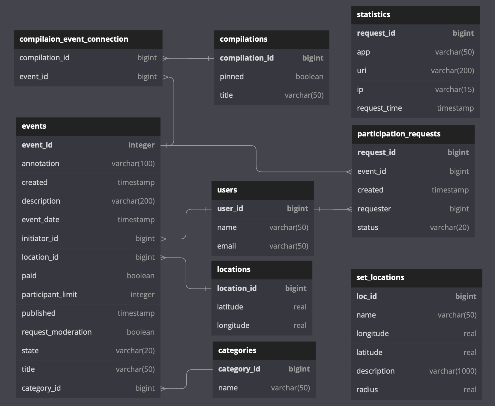

# _Explore with me (EWM)_

[ФИЧА](#feature)

#### _Описание_

Приложение дает возможность делиться информацией об интересных событиях и помогать найти компанию для участия в них.

Вид главной страницы:

Проект является бэкэндом приложения.

#### _Используемые технологии_

Spring-Boot(2.7.1), jpa, postgresql(42.5.0), h2(2.1.214), java-core(jdk 11), lombok(1.18.24),
docker(20.10.17), docker-compose(2.10.2).

#### _Состав проекта_

Проект состоит из двух микросервисов:

1. Основной сервис — содержит всё необходимое для работы продукта.  
   Запускается на 8080 порту.  
   [ewm-main](./ewm-main/README.md)  
   [API (swagger)](https://petstore.swagger.io?url=https://raw.githubusercontent.com/EvgenyGH/java-explore-with-me/feachure_set_locations/ewm-main/ewm-main-service-spec.yaml)

2. Сервис статистики — хранит количество просмотров и позволяет делать различные
   выборки для анализа работы приложения. Запускается на 9090 порту.  
   [ewm-stats](./ewm-stats/README.md)  
   [API (swagger)](https://petstore.swagger.io?url=https://raw.githubusercontent.com/EvgenyGH/java-explore-with-me/main/ewm-stats/ewm-stats-service-spec.json)

Каждый из сервисов работает со своей базой данных postgres.

ER:

#### _Запуск проекта_

Для запуска проекта потребуется docker(20.10.17) и docker-compose(2.10.2).  
Запуск из командной строки:  
_`docker-compose -p ewm up`_

Порядок запуска в ручном режиме:

1. Запустить сервис статистики.  
   1.1. Установить переменные среды.  
   1.2. Запустить базу данных сервиса статистики.  
   1.3. Запустить сервис статистики.
2. Запуск основного сервиса.  
   2.1. Установить переменные среды.  
   2.2. Запустить базу данных основного сервиса.  
   2.3. Запустить основной сервис.

_Переменные среды для сервисов и их значения по
умолчанию в docker-compose:_

1. Сервис статистики:
    - DB_USER=ewm
    - DB_PASSWORD=pwd
    - DB_HOST=db-stats
    - DB_PORT=5432
    - DB_NAME=ewm-stats
    - STATS_SERVER_PORT=9090

2. База данных сервиса статистики:
    - POSTGRES_PASSWORD=pwd
    - POSTGRES_USER=ewm
    - POSTGRES_DB=ewm-stats

3. Основной сервис:
    - DB_USER=ewm
    - DB_PASSWORD=pwd
    - DB_HOST=db-main
    - DB_PORT=5432
    - DB_NAME=ewm
    - STATS_SERVER_PORT=9090
    - STATS_SERVER_HOST=ewm-stats
    - MAIN_SERVER_PORT=8080

4. База данных основного сервиса:
    - POSTGRES_PASSWORD=pwd
    - POSTGRES_USER=ewm
    - POSTGRES_DB=ewm-stats

___

# Feature

Реализована возможность для администратора добавлять конкретные локации — города, театры,
концертные залы и другие в виде координат (широта, долгота, радиус).   
На публичном контроллере реализовано получение списка этих локаций и
возможность поиска событий в конкретной локации.  

Admin endpoints: 

    * Добавить новую локацию.
    Patch admin/location/{locId}
    
    * Обновить локацию по id.
    Patch admin/location/{locId}

    * Удалить локацию по id.
    Delete admin/location/{locId}

Client Endpoints:

    * Получить локацию по id.
    Get location/{locId}

    * Получить все локации.
    Get location/all

    * Найти события в заданной локации с учетом фильтра.
    Get location/{locId}/event