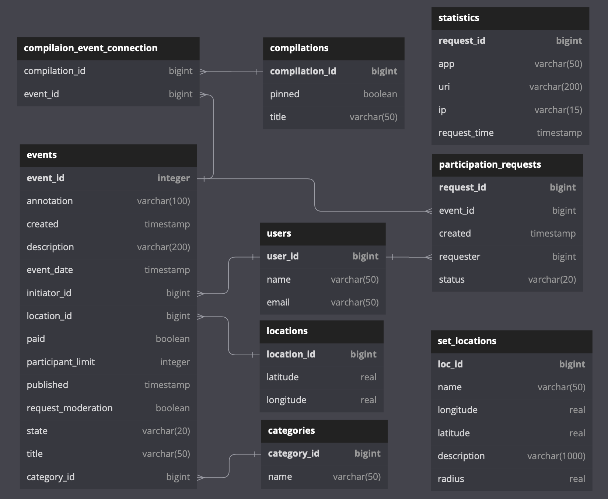

# _Explore with me (EWM)_
## Сервис статистики (EWM-STATS)

#### _Описание_

Сервис статистики — хранит количество просмотров и позволяет делать различные
выборки для анализа работы приложения [ewm](./../README.md).  
Запускается на 9090 порту.  
[API (swagger)](https://petstore.swagger.io?url=https://raw.githubusercontent.com/EvgenyGH/java-explore-with-me/feachure_set_locations/ewm-stats/ewm-stats-service-spec.yaml)

#### _Используемые технологии_

Spring-Boot(2.7.1), jpa, postgresql(42.5.0), java-core(jdk 11), lombok(1.18.24),
docker(20.10.17), docker-compose(2.10.2).

#### _Состав проекта_

Проект состоит из сервиса и базы данных postgres:

Общие ER проекта:

#### _Запуск проекта_

Для запуска проекта потребуется docker(20.10.17) и docker-compose(2.10.2).  
Запуск из командной строки:  
_`docker-compose -p ewm-stats up`_

Порядок запуска в ручном режиме:
1. Запустить сервис статистики.  
   1.1. Установить переменные среды.  
   1.2. Запустить базу данных сервиса статистики.  
   1.3. Запустить сервис статистики.

_Переменные среды для сервисов и их значения по
умолчанию в docker-compose:_
1. Сервис статистики:
    - DB_USER=ewm
    - DB_PASSWORD=pwd
    - DB_HOST=db-stats
    - DB_PORT=5432
    - DB_NAME=ewm-stats
    - STATS_SERVER_PORT=9090

2. База данных сервиса статистики:
    - POSTGRES_PASSWORD=pwd
    - POSTGRES_USER=ewm
    - POSTGRES_DB=ewm-stats